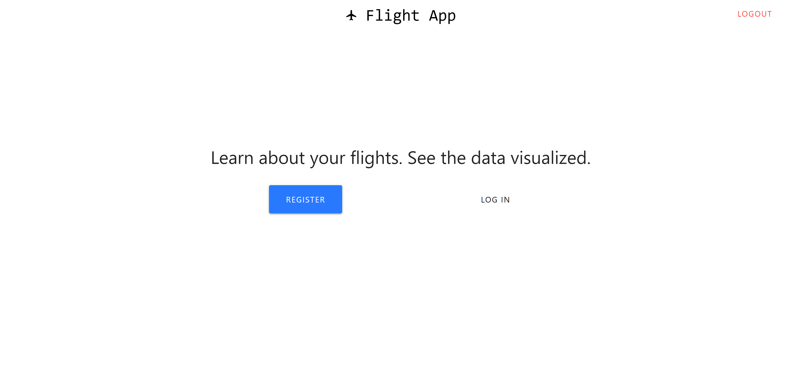
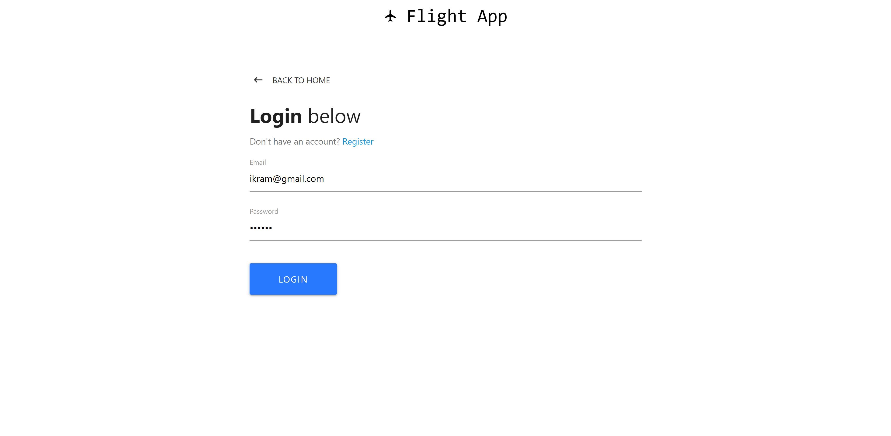
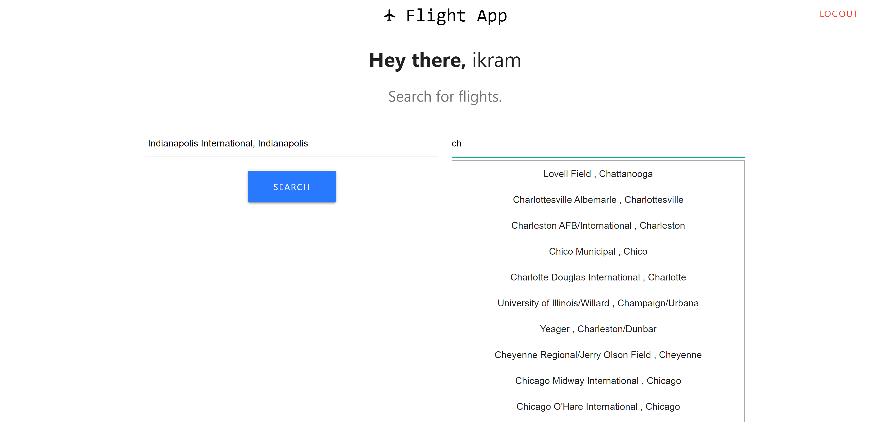

# Flights Delay Information App

A Node, Express, MySql, React app. Finds and displays information regarding delays from a specific origin to a destination of different flights defined by the user. All viusualizations created using Apex Charts.

## Flight Data

Data used is made available by Bureau of Transportation Statistics. https://www.transtats.bts.gov/DL_SelectFields.asp?Table_ID=236&DB_Short_Name=On-Time

## Database Information

Inside the config folder:

1. Create a file called keys.js
2. Add this snippet of code:
   module.exports = {
   mysqlURI: {
   host: "your_hostname",
   user: "your_username",
   password: "your_password",
   database: "your_database_name"
   },
   secretOrKey: "secret"
   };

## Screenshots

### HOME

### REGISTER

### LOGIN

### DASHBOARD_1

### DASHBOARD_2

