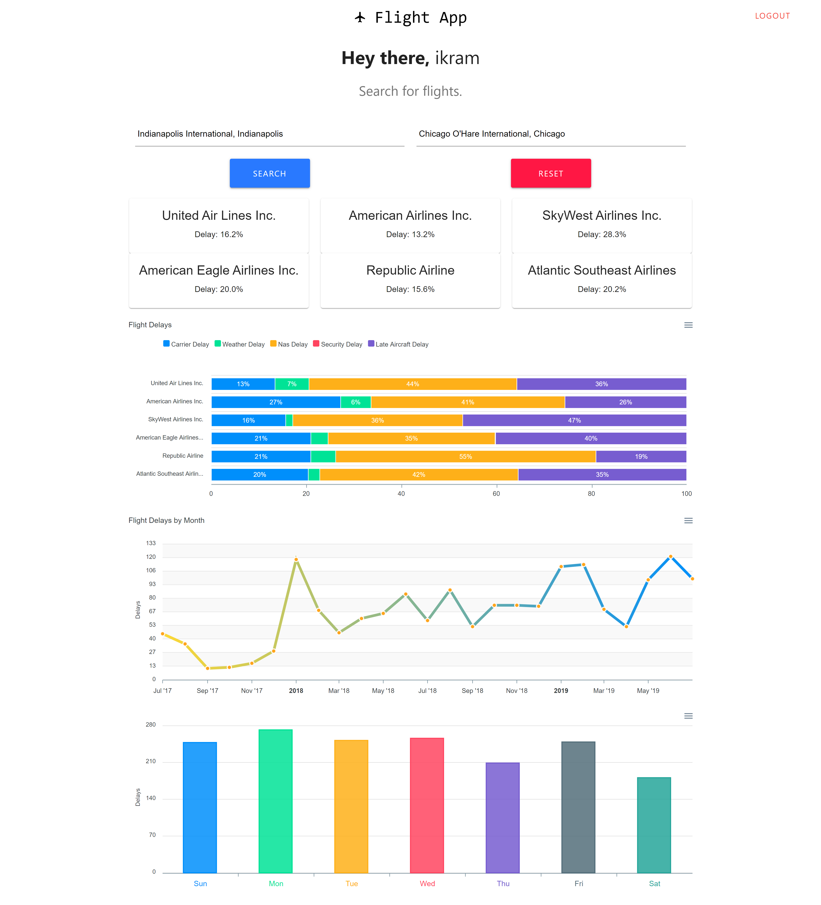

# Flights Delay Information App

A Node, Express, MySql, React app. Finds and displays information regarding delays from a specific origin to a destination of different flights defined by the user. All viusualizations created using Apex Charts.

## Flight Data

Data used is made available by Bureau of Transportation Statistics. https://www.transtats.bts.gov/DL_SelectFields.asp?Table_ID=236&DB_Short_Name=On-Time

## Quick Start

### Inside the config folder, create a file called keys.js with the following:

```
module.exports = {
  mysqlURI: {
    host: "your_hostname",
    user: "your_username",
    password: "your_password",
    database: "your_database_name"
  },
  secretOrKey: "secret"
};
```

### Install server dependencies

```
npm install
```

### Install client dependencies

```
cd client
npm install
```

### Run both Express & React from root

```
npm run dev
```

## Screenshots

### HOME


### REGISTER


### LOGIN


### DASHBOARD_1


### DASHBOARD_2


